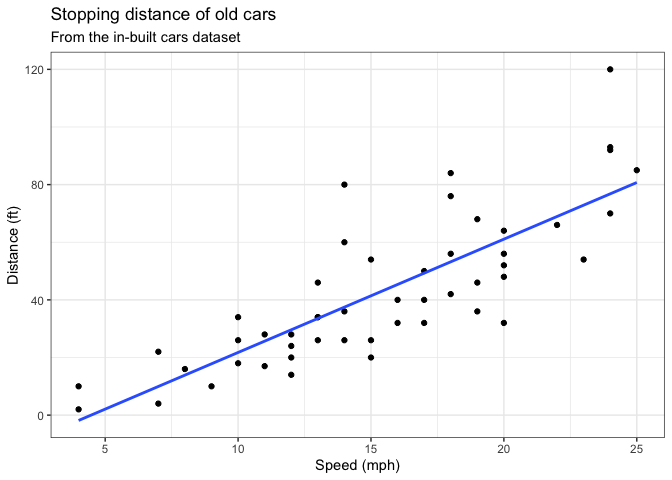
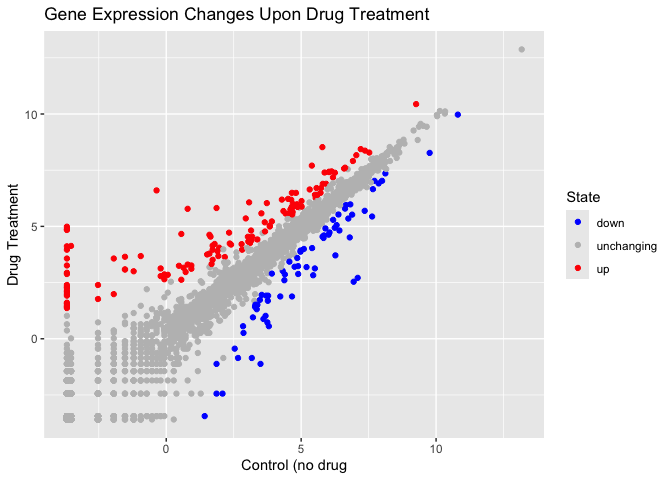
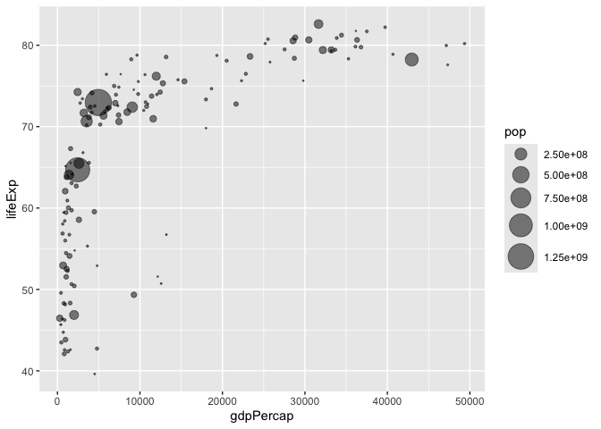
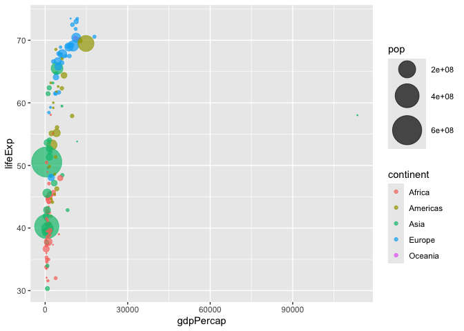

# Lab 5 Data Visualization with ggplot
Thoi Tran (A17035545)

## Plotting in R

R has lot’s of way to make plots and figure. This includes so-called
**base** graphics and packages like **ggplot2**

``` r
plot(cars)
```


This is a **base** R plot of the in-built `cars` data set that only has
two columns

``` r
head(cars)
```

      speed dist
    1     4    2
    2     4   10
    3     7    4
    4     7   22
    5     8   16
    6     9   10

``` r
tail(cars)
```

       speed dist
    45    23   54
    46    24   70
    47    24   92
    48    24   93
    49    24  120
    50    25   85

> Q. ow would we plot this dataset with **ggplot**?

All ggplot figures have at least 3 layers:

- **data**
- **aes** (how the data map to the plot)
- **geoms** (how we draw the plot, lines, points, etc.)

Before I use any new package, I need to download and instal it with the
`install.packages()` command

I never use `install.packages()` within my quarto document othewise I
will install the package over and over and over again - which is silly!

Once a package is installed, I can load it up with the `library`
function

``` r
# install.packages("ggplot2")
library(ggplot2)
ggplot(cars)+
  aes(x = speed, y = dist)+
  geom_point()
```


**Key-points**: For simple plots (like the one above), ggplot is more
verbose (we need to do more typing) but as plots get more complicated
ggplot starts to be more clear and simple than base R plot()

Answers to questions and codes are below

> Q1. For which phases is data visualization important in our scientific
> workflows?

All of the above

> Q2. True or False? The ggplot2 package comes already installed with R?

FALSE

> Q3. Which plot types are typically NOT used to compare distributions
> of numeric variables?

Network graphs

> Q4. Which statement about data visualization with ggplot2 is
> incorrect?

ggplot2 is the only way to create plots in R

> Q5. Which geometric layer should be used to create scatter plots in
> ggplot2?

geom_point()

### Cars Scatter Plot

> Q6. In your own RStudio can you add a trend line layer to help show
> the relationship between the plot variables with the geom_smooth()
> function?

``` r
ggplot(cars)+
  aes(x = speed, y = dist)+
  geom_point()+
  geom_smooth()
```

    `geom_smooth()` using method = 'loess' and formula = 'y ~ x'


> Q7. Argue with geom_smooth() to add a straight line from a linear
> model without the shaded standard error region?

``` r
ggplot(cars)+
  aes(x = speed, y = dist)+
  geom_point()+
  geom_smooth(method = "lm", se = FALSE)
```

    `geom_smooth()` using formula = 'y ~ x'


> Q8. Can you finish this plot by adding various label annotations with
> the labs() function and changing the plot look to a more conservative
> “black & white” theme by adding the theme_bw() function:

``` r
ggplot(cars)+
  aes(x = speed, y = dist)+
  geom_point()+
  geom_smooth(method = "lm", se = FALSE)+
  labs(title = "Stopping distance of old cars",
       subtitle = "From the in-built cars dataset")+
  theme_bw()+
  xlab("Speed (mph)")+
  ylab("Distance (ft)")
```

    `geom_smooth()` using formula = 'y ~ x'



### Gene Expression Scatterplot

Here we will:

- Adjust the point size of a scatter plot using the `size` parameter.
- Change the point color of a scatter plot using the `color` parameter.
- Set a parameter `alpha` to change the transparency of all points.

``` r
url <- "https://bioboot.github.io/bimm143_S20/class-material/up_down_expression.txt"
genes <- read.delim(url)
head(genes)
```

            Gene Condition1 Condition2      State
    1      A4GNT -3.6808610 -3.4401355 unchanging
    2       AAAS  4.5479580  4.3864126 unchanging
    3      AASDH  3.7190695  3.4787276 unchanging
    4       AATF  5.0784720  5.0151916 unchanging
    5       AATK  0.4711421  0.5598642 unchanging
    6 AB015752.4 -3.6808610 -3.5921390 unchanging

> Q9. Use the `nrow()` function to find out how many genes are in this
> dataset. What is your answer?

``` r
nrow(genes)
```

    [1] 5196

There are 5196 genes in this dataset

> Q10. Use the `colnames()` function and the `ncol()` function on the
> `genes` data frame to find out what the column names are (we will need
> these later) and how many columns there are. How many columns did you
> find?

``` r
colnames(genes)
```

    [1] "Gene"       "Condition1" "Condition2" "State"     

``` r
ncol(genes)
```

    [1] 4

There are 4 columns/variables in this dataset

> Q11. Use the `table()` function on the `State` column of this
> data.frame to find out how many ‘up’ regulated genes there are. What
> is your answer?

``` r
table(genes$State)
```


          down unchanging         up 
            72       4997        127 

There are 127 ‘up’ regulated genes

> Q12. Using your values above and 2 significant figures. What fraction
> of total genes is up-regulated in this dataset?

``` r
round(table(genes$State)/nrow(genes) * 100, 2)
```


          down unchanging         up 
          1.39      96.17       2.44 

2.44% of total genes is up-regulated in this dataset

> Q13. Complete the code below to produce the following plot

``` r
ggplot(genes) + 
    aes(x=Condition1, y=Condition2) +
    geom_point()
```


Map `State` column to point color

``` r
p <- ggplot(genes) + 
  aes(x=Condition1, y=Condition2, color = State) +
  geom_point()
```

Specify the color scale

``` r
p + scale_color_manual(values = c("blue", "gray", "red"))
```


> Q14. Nice, now add some plot annotations to the p object with the
> labs() function so your plot looks like the following:

``` r
p + 
  scale_color_manual(values = c("blue", "gray", "red"))+
  labs(title = "Gene Expression Changes Upon Drug Treatment")+
  xlab("Control (no drug")+
  ylab("Drug Treatment")
```



### Gapminder Dataset

``` r
library(gapminder)
library(dplyr)
```


    Attaching package: 'dplyr'

    The following objects are masked from 'package:stats':

        filter, lag

    The following objects are masked from 'package:base':

        intersect, setdiff, setequal, union

``` r
gapminder_2007 <- gapminder %>% filter(year==2007)
```

> Q15. Complete the code below to produce a first basic scater plot of
> this `gapminder_2007` dataset:

``` r
ggplot(gapminder_2007) +
  aes(x=gdpPercap, y=lifeExp) +
  geom_point(alpha=0.5)
```


### Adding More Variables to aes()

Map the `continent` variable to the point `color` aesthetic and the
population pop (in millions) through the point `size` argument to
`aes()`

``` r
ggplot(gapminder_2007) +
  aes(x=gdpPercap, y=lifeExp, color=continent, size=pop) +
  geom_point(alpha=0.5)
```


Color the points by the numeric variable population `pop`

``` r
ggplot(gapminder_2007) + 
  aes(x = gdpPercap, y = lifeExp, color = pop) +
  geom_point(alpha=0.8)
```


Adjusting point `size`

``` r
ggplot(gapminder_2007) + 
  geom_point(aes(x = gdpPercap, y = lifeExp,
                 size = pop), alpha=0.5) + 
  scale_size_area(max_size = 10)
```



> Q16. Can you adapt the code you have learned thus far to reproduce our
> gapminder scatter plot for the year 1957? What do you notice about
> this plot is it easy to compare with the one for 2007?

``` r
gapminder_1957 <- gapminder %>% filter(year==1957)
ggplot(gapminder_1957) + 
  geom_point(aes(x = gdpPercap, y = lifeExp, color = continent,
                 size = pop), alpha=0.7) + 
  scale_size_area(max_size = 15)
```



> Q17. Do the same steps above but include 1957 and 2007 in your input
> dataset for ggplot(). You should now include the layer
> facet_wrap(~year) to produce the following plot:

``` r
gapminder_data <- gapminder %>% filter(year==1957 | year==2007)
ggplot(gapminder_data) + 
  geom_point(aes(x = gdpPercap, y = lifeExp, color = continent,
                 size = pop), alpha=0.7) + 
  scale_size_area(max_size = 10)+
  facet_wrap(~year)
```


``` r
table(gapminder$year)
```


    1952 1957 1962 1967 1972 1977 1982 1987 1992 1997 2002 2007 
     142  142  142  142  142  142  142  142  142  142  142  142 

``` r
unique(gapminder$year)
```

     [1] 1952 1957 1962 1967 1972 1977 1982 1987 1992 1997 2002 2007

``` r
length(unique(gapminder$year))
```

    [1] 12

``` r
ggplot(mtcars) + aes(x=mpg, y=disp) + geom_point()
```


``` r
ggplot(mtcars, aes(mpg, disp)) + geom_point()
```


``` r
filter(gapminder, country == "Ireland", year == max(gapminder$year))
```

    # A tibble: 1 × 6
      country continent  year lifeExp     pop gdpPercap
      <fct>   <fct>     <int>   <dbl>   <int>     <dbl>
    1 Ireland Europe     2007    78.9 4109086    40676.

``` r
filter(gapminder, year == 2007, pop < filter(gapminder, country == "Ireland", year == 2007)$pop)$country
```

     [1] Albania               Bahrain               Botswana             
     [4] Comoros               Congo, Rep.           Djibouti             
     [7] Equatorial Guinea     Gabon                 Gambia               
    [10] Guinea-Bissau         Iceland               Jamaica              
    [13] Kuwait                Lebanon               Lesotho              
    [16] Liberia               Mauritania            Mauritius            
    [19] Mongolia              Montenegro            Namibia              
    [22] Oman                  Panama                Puerto Rico          
    [25] Reunion               Sao Tome and Principe Slovenia             
    [28] Swaziland             Trinidad and Tobago   Uruguay              
    [31] West Bank and Gaza   
    142 Levels: Afghanistan Albania Algeria Angola Argentina Australia ... Zimbabwe

``` r
unique(gapminder$country)
```

      [1] Afghanistan              Albania                  Algeria                 
      [4] Angola                   Argentina                Australia               
      [7] Austria                  Bahrain                  Bangladesh              
     [10] Belgium                  Benin                    Bolivia                 
     [13] Bosnia and Herzegovina   Botswana                 Brazil                  
     [16] Bulgaria                 Burkina Faso             Burundi                 
     [19] Cambodia                 Cameroon                 Canada                  
     [22] Central African Republic Chad                     Chile                   
     [25] China                    Colombia                 Comoros                 
     [28] Congo, Dem. Rep.         Congo, Rep.              Costa Rica              
     [31] Cote d'Ivoire            Croatia                  Cuba                    
     [34] Czech Republic           Denmark                  Djibouti                
     [37] Dominican Republic       Ecuador                  Egypt                   
     [40] El Salvador              Equatorial Guinea        Eritrea                 
     [43] Ethiopia                 Finland                  France                  
     [46] Gabon                    Gambia                   Germany                 
     [49] Ghana                    Greece                   Guatemala               
     [52] Guinea                   Guinea-Bissau            Haiti                   
     [55] Honduras                 Hong Kong, China         Hungary                 
     [58] Iceland                  India                    Indonesia               
     [61] Iran                     Iraq                     Ireland                 
     [64] Israel                   Italy                    Jamaica                 
     [67] Japan                    Jordan                   Kenya                   
     [70] Korea, Dem. Rep.         Korea, Rep.              Kuwait                  
     [73] Lebanon                  Lesotho                  Liberia                 
     [76] Libya                    Madagascar               Malawi                  
     [79] Malaysia                 Mali                     Mauritania              
     [82] Mauritius                Mexico                   Mongolia                
     [85] Montenegro               Morocco                  Mozambique              
     [88] Myanmar                  Namibia                  Nepal                   
     [91] Netherlands              New Zealand              Nicaragua               
     [94] Niger                    Nigeria                  Norway                  
     [97] Oman                     Pakistan                 Panama                  
    [100] Paraguay                 Peru                     Philippines             
    [103] Poland                   Portugal                 Puerto Rico             
    [106] Reunion                  Romania                  Rwanda                  
    [109] Sao Tome and Principe    Saudi Arabia             Senegal                 
    [112] Serbia                   Sierra Leone             Singapore               
    [115] Slovak Republic          Slovenia                 Somalia                 
    [118] South Africa             Spain                    Sri Lanka               
    [121] Sudan                    Swaziland                Sweden                  
    [124] Switzerland              Syria                    Taiwan                  
    [127] Tanzania                 Thailand                 Togo                    
    [130] Trinidad and Tobago      Tunisia                  Turkey                  
    [133] Uganda                   United Kingdom           United States           
    [136] Uruguay                  Venezuela                Vietnam                 
    [139] West Bank and Gaza       Yemen, Rep.              Zambia                  
    [142] Zimbabwe                
    142 Levels: Afghanistan Albania Algeria Angola Argentina Australia ... Zimbabwe
